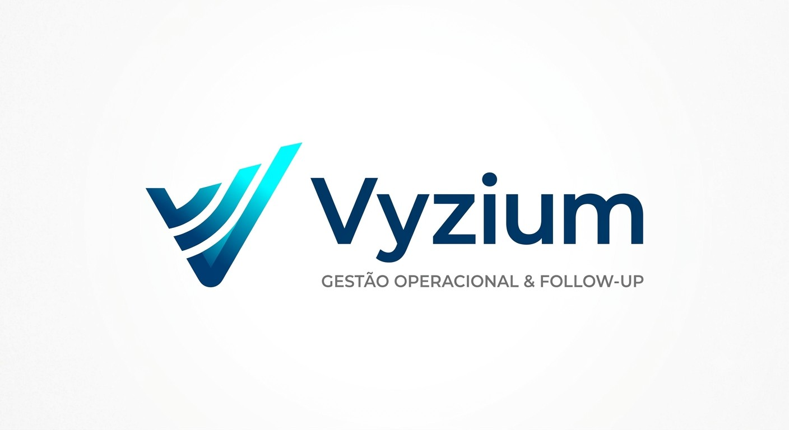

  

  
  
  
  
  

  <strong>Controle de ordens de compra, acompanhamento de fornecedores e follow-up em uma única operação.</strong> 
  Uma solução desktop criada para transformar planilhas de compras em uma rotina visual, organizada e rastreável.

  <a href="https://github.com/solucionx/Vyzium/releases/latest"><strong>Baixar Vyzium para Windows</strong></a>
  &nbsp;&nbsp;•&nbsp;&nbsp;
  <a href="https://github.com/solucionx/Vyzium"><strong>Repositório oficial</strong></a>

Vyzium

O Vyzium é uma plataforma desktop de gestão operacional e follow-up de compras criada para centralizar o acompanhamento diário de ordens de compra.

A aplicação organiza prazos, fornecedores, atendimento, aprovações, observações e próximas ações em uma interface única. A partir da base de compras importada, o Vyzium transforma dados dispersos em uma visão operacional clara para que a equipe consiga identificar rapidamente o que precisa de atenção.

O objetivo é simples: reduzir controles manuais, dar visibilidade à operação e tornar o acompanhamento com fornecedores mais consistente.

Principais recursos

Controle operacional

Visualização central das ordens de compra com informações essenciais para o acompanhamento diário:

prazo e nível de urgência;

hotel ou unidade;

número da OC;

fornecedor;

previsão de entrega;

situação de atendimento;

aprovação;

controle e observação manual;

próxima ação sugerida.

Dashboard

Indicadores operacionais para acompanhar rapidamente a situação da base, com cards interativos e acesso direto aos pedidos que exigem atenção.

Pedidos

Consulta detalhada das ordens, com filtros persistentes e visão dos itens, quantidades, recebimentos, saldo e previsão de entrega.

Fornecedores

Cadastro local de contatos e telefones, associado ao fornecedor para reutilização automática nas ordens futuras.

Follow-up por WhatsApp

O Vyzium prepara e organiza as mensagens de acompanhamento por fornecedor, permitindo revisão antes do envio e execução em lote.

O fluxo inclui:

agrupamento de ordens do mesmo fornecedor;

prévia das mensagens;

envio em lote;

acompanhamento da conexão em segundo plano;

fila persistente de processamento;

histórico local das tentativas e envios;

proteção contra reenvios indevidos.

A integração utiliza WhatsApp Web. Ela não substitui a API oficial do WhatsApp Business e pode depender de mudanças feitas pelo próprio serviço.

Fluxo operacional

Base de compras
      │
      ▼
Importação e consolidação
      │
      ├────► Dashboard
      │
      ├────► Controle operacional
      │
      ├────► Pedidos
      │
      └────► Fornecedores
                  │
                  ▼
           Preparação do follow-up
                  │
                  ▼
             Envio em lote
                  │
                  ▼
               Histórico

Áreas do sistema

Área

Finalidade

Controle operacional

Acompanhamento diário das ordens e prioridades

Dashboard

Indicadores e visão rápida da operação

Pedidos

Consulta detalhada e filtrada das OCs

Fornecedores

Telefones e contatos utilizados no follow-up

Mensagens

Revisão e execução dos lotes de acompanhamento

Histórico

Registro local das cobranças e tentativas

Configurações

Regras operacionais, automação e conexão do WhatsApp

Dados locais e continuidade da operação

O Vyzium mantém os dados próprios do acompanhamento separados da planilha importada.

Isso permite preservar informações como:

controles manuais;

observações;

telefones dos fornecedores;

configurações;

histórico de follow-up;

fila de mensagens;

sessão local do WhatsApp.

Novas importações atualizam o retrato operacional das ordens sem substituir os dados que pertencem ao acompanhamento realizado dentro do Vyzium.

Privacidade e segurança local

O núcleo da aplicação roda no próprio computador do usuário.

motor de processamento local;

persistência em SQLite;

comunicação interna restrita ao aplicativo;

arquivos de sessão e banco local fora do repositório;

atualização do aplicativo sem substituir os dados operacionais do usuário.

Arquivos reais de operação, banco de dados, sessões do WhatsApp e informações persistentes não devem ser publicados no GitHub.

Tecnologia

  

Camada

Tecnologia

Aplicativo desktop

Electron

Interface

HTML, CSS e JavaScript

Motor local

Python

Persistência

SQLite

Planilhas

Excel .xlsx / .xlsm

Follow-up

WhatsApp Web

Distribuição

Instalador para Windows

Arquitetura

Vyzium/
├── electron/      Aplicativo desktop e integração do sistema
├── renderer/      Interface e experiência visual
├── backend/       Motor de regras, importação e persistência
├── build/         Recursos de empacotamento e identidade
├── scripts/       Inicialização e build
└── tests/         Testes automatizados

Windows

O Vyzium é distribuído como aplicativo desktop para Windows 10 e Windows 11, 64 bits.

A versão disponível para instalação pode ser encontrada na área oficial de Releases:

  <a href="https://github.com/solucionx/Vyzium/releases/latest"><strong>→ Acessar download para Windows</strong></a>

  

  <strong>Vyzium</strong> 
  Gestão Operacional &amp; Follow-up  
  Desenvolvido pela <strong>Solucionx</strong>

