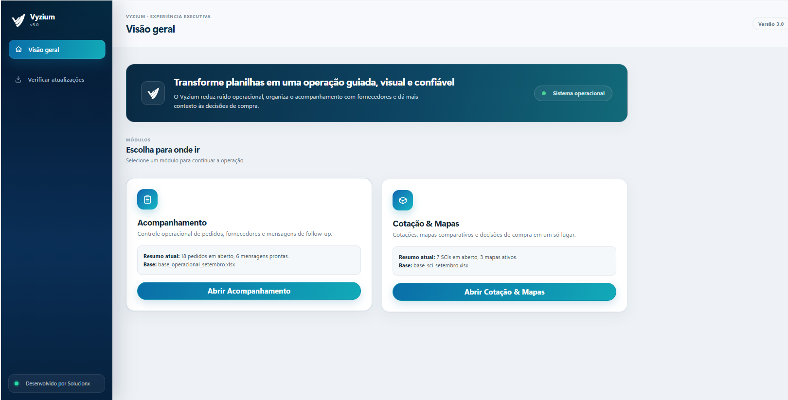
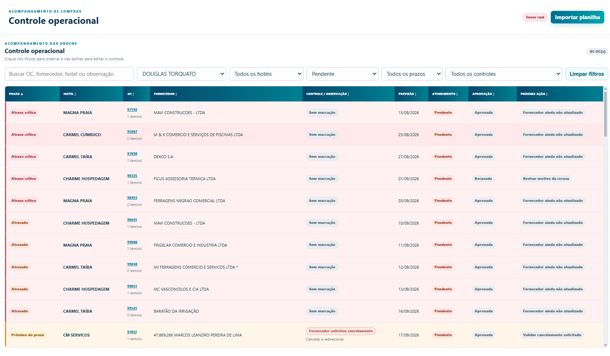
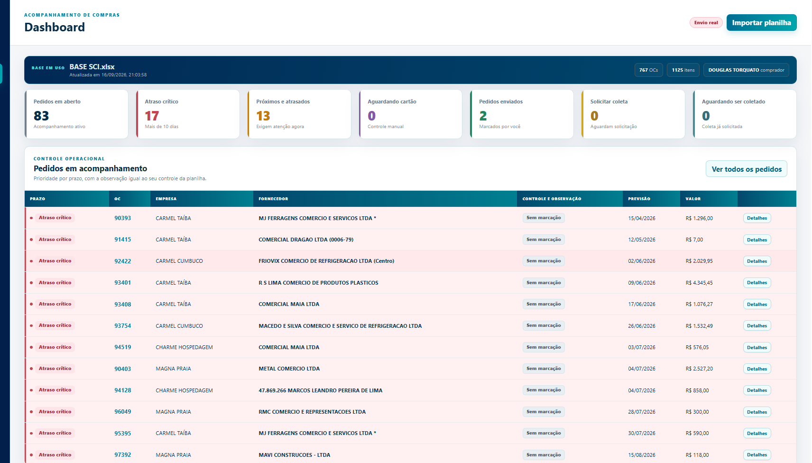

<p align="center">
  
</p>

<p align="center">
  <a href="https://github.com/solucionx/Vyzium/releases/latest"></a>
  <a href="https://github.com/solucionx/Vyzium/releases"></a>
  
  
  
</p>

<p align="center">
  <strong>Transforme planilhas em uma operação guiada, visual e confiável.</strong><br>
  O Vyzium reúne <strong>Acompanhamento</strong> e <strong>Cotação &amp; Mapas</strong> em um único aplicativo desktop, mantendo cada fluxo e cada base independentes.
</p>

---

## ✦ Um único Vyzium, dois módulos independentes

A versão 3.0 unifica os dois fluxos em uma única experiência. O aplicativo inicia na **Visão geral**, apresenta os módulos disponíveis e direciona o usuário para a área correta sem carregar tabelas pesadas desnecessariamente.

<p align="center">
  
</p>

<table>
<tr>
<td width="50%" valign="top">

### ◈ Acompanhamento
Voltado ao follow-up operacional de ordens, fornecedores, prazos, entregas e mensagens.

- Controle operacional;
- Dashboard;
- Pedidos;
- fornecedores e contatos;
- mensagens e follow-up;
- histórico local.

</td>
<td width="50%" valign="top">

### ◫ Cotação & Mapas
Voltado à rotina de SCI, cotação, negociação e decisão de compra.

- Dashboard de itens;
- itens a comprar;
- filtros operacionais;
- mapas de compra;
- comparação de fornecedores;
- histórico de solicitações.

</td>
</tr>
</table>

> **Bases independentes:** importar ou trabalhar em um módulo não substitui a base operacional do outro.

---

## ✦ Acompanhamento operacional

O módulo **Acompanhamento** transforma a base importada em uma visão operacional com prioridade, prazo, fornecedor, atendimento, aprovação, observações e próxima ação.

<p align="center">
  
</p>

> **Foco operacional:** identificar rapidamente o que está atrasado, o que está próximo do prazo e quais fornecedores ainda precisam de acompanhamento.

---

## ✦ O que o Acompanhamento reúne

<table>
<tr>
<td width="33%" valign="top">

### ◈ Controle operacional
Acompanhamento das OCs em uma tabela única, com prioridade visual, filtros persistentes, observações e próxima ação. O filtro de **Atendimento** aceita múltiplos status ao mesmo tempo — por exemplo, **Pendente + Atendida parcialmente**.

</td>
<td width="33%" valign="top">

### ◫ Dashboard
Indicadores para enxergar o cenário da operação sem precisar percorrer toda a base manualmente.

</td>
<td width="33%" valign="top">

### ✓ Pedidos
Consulta das ordens e itens com previsão, atendimento, aprovação e contexto do fornecedor.

</td>
</tr>
<tr>
<td width="33%" valign="top">

### ◎ Fornecedores
Telefones e contatos ficam associados ao fornecedor e podem ser reutilizados nas próximas importações do módulo.

</td>
<td width="33%" valign="top">

### ↗ Follow-up
Mensagens organizadas por fornecedor, prévia antes do envio e execução em lote pelo WhatsApp Web.

</td>
<td width="33%" valign="top">

### ◷ Histórico
Registro local das tentativas e envios para manter rastreabilidade da rotina de acompanhamento.

</td>
</tr>
</table>

---

## ✦ Dashboard operacional

O Dashboard resume os pontos que precisam de atenção e mantém a operação ligada aos pedidos que originaram cada indicador.

<p align="center">
  
</p>

---

## ✦ Cotação & Mapas

O módulo **Cotação & Mapas** recebe a **BASE SCI** e conduz o fluxo desde os itens pendentes até a comparação das propostas dos fornecedores.

<table>
<tr>
<td width="33%" valign="top">

### ▣ Dashboard por linhas
A carga de trabalho é medida por **linhas / itens**, evitando que várias SCIs com muitos itens sejam interpretadas apenas como poucos pedidos.

</td>
<td width="33%" valign="top">

### ⌕ Filtros operacionais
Filtros por comprador, hotel, grupo, atendimento, aprovação, prazo, controle e busca por SCI, artigo ou descrição.

</td>
<td width="33%" valign="top">

### ◇ Mapas de compra
Itens selecionados podem ser reunidos em mapas independentes, mantendo hotel, SCI, quantidade e contexto da demanda.

</td>
</tr>
<tr>
<td width="33%" valign="top">

### % Negociação automática
Informe o **1º valor** e o **valor negociado**. O Vyzium calcula automaticamente o percentual de desconto, economia e total líquido.

</td>
<td width="33%" valign="top">

### ✓ Comparação por item
O sistema identifica o menor valor líquido por item, trata empates e resume os vencedores sem gerar ou confirmar uma OC automaticamente.

</td>
<td width="33%" valign="top">

### ↓ Exportação Excel
O mapa pode ser exportado em **`.xls`**, preservando itens, fornecedores, preço bruto, desconto e total líquido.

</td>
</tr>
</table>

---

## ✦ Fluxo de Cotação & Mapas

```text
BASE SCI (.xls / .xlsx / .xlsm)
          │
          ▼
IMPORTAÇÃO E VALIDAÇÃO
          │
          ├──────────────► Dashboard por linhas / itens
          └──────────────► Itens a comprar
                                  │
                                  ▼
                        SELEÇÃO DOS ITENS
                                  │
                                  ▼
                         MAPA DE COMPRA
                                  │
             ┌────────────────────┴────────────────────┐
             ▼                                         ▼
     Fornecedores / WhatsApp                 Preços e negociação
                                                       │
                                                       ▼
                                     desconto automático + comparação
                                                       │
                                     ┌─────────────────┴──────────────┐
                                     ▼                                ▼
                               Exportar .xls                    Histórico local
```

Mapas existentes são preservados entre importações. Se a nova base alterar itens já usados em um mapa, o Vyzium sinaliza a mudança para evitar envio com dados desatualizados.

Ao trocar de **Cotação & Mapas** para **Acompanhamento** (ou voltar para a Visão geral) com um mapa editado e ainda não salvo, o Vyzium interrompe a navegação e oferece três ações: **Salvar e continuar**, **Descartar e continuar** ou **Cancelar**. Assim, uma troca rápida de módulo não perde uma cotação em andamento por engano.

---

## ✦ Follow-up e solicitações pelo WhatsApp

Os dois módulos utilizam a mesma infraestrutura local de WhatsApp, evitando duas sessões concorrentes no mesmo aplicativo.

### No Acompanhamento

- agrupa ordens relacionadas ao mesmo fornecedor;
- prepara a prévia antes do envio;
- executa o lote de forma sequencial;
- mantém a conexão acompanhada em segundo plano;
- registra o resultado localmente;
- evita que uma falha em um fornecedor interrompa todo o lote.

### Em Cotação & Mapas

- cadastra fornecedores e respectivos números no mapa;
- monta automaticamente a solicitação com os itens daquele mapa;
- não expõe preços de concorrentes na mensagem;
- registra cada solicitação no histórico;
- diferencia envio concluído, falha e envio incerto para evitar repetição automática insegura.

> A integração atual utiliza **WhatsApp Web**. Ela apoia o fluxo operacional dentro do aplicativo e não substitui a API oficial do WhatsApp Business.

---

## ✦ Da planilha ao acompanhamento

```text
BASE OPERACIONAL (.xlsx / .xlsm)
          │
          ▼
IMPORTAÇÃO E CONSOLIDAÇÃO
          │
          ├──────────────► Dashboard
          ├──────────────► Controle operacional
          ├──────────────► Pedidos
          └──────────────► Fornecedores
          │
          ▼
IDENTIFICAÇÃO DE PENDÊNCIAS
          │
          ▼
FOLLOW-UP POR FORNECEDOR
          │
          ▼
ENVIO EM LOTE + HISTÓRICO LOCAL
```

O Vyzium preserva o contexto criado dentro do próprio aplicativo — como contatos, observações, controles e histórico — mesmo quando uma nova base é importada.

---

## ✦ Continuidade e separação dos dados

A unificação da interface não mistura os dados dos dois fluxos.

<table>
<tr>
<td width="50%" valign="top">

### Acompanhamento

**Permanece no Vyzium**

- observações manuais;
- controles operacionais;
- telefones dos fornecedores;
- configurações;
- histórico de follow-up;
- fila de mensagens;
- sessão local do WhatsApp.

**A nova importação atualiza**

- ordens de compra;
- itens;
- quantidades;
- recebimentos;
- previsões;
- situação operacional vinda da base.

</td>
<td width="50%" valign="top">

### Cotação & Mapas

**Permanece no módulo**

- mapas criados;
- fornecedores cadastrados no mapa;
- preços e valores negociados;
- observações e tipo de compra;
- histórico de solicitações;
- filtros e preferências do módulo.

**A nova BASE SCI atualiza**

- itens elegíveis;
- SCI;
- quantidade e unidade;
- comprador;
- hotel;
- status e aprovação;
- prazo calculado a partir da aprovação.

</td>
</tr>
</table>

---

## ✦ Desempenho pensado para dois módulos

A versão 3.0 foi estruturada para unificar o produto sem obrigar os dois fluxos a carregarem tudo ao mesmo tempo.

- apenas uma interface Electron;
- a **Visão geral** carrega somente o resumo necessário;
- o frontend renderiza o módulo aberto;
- o motor de Acompanhamento permanece disponível para preservar os serviços de follow-up;
- o motor de Cotação & Mapas é iniciado sob demanda;
- bancos, importadores e caches permanecem independentes;
- uma única ponte de WhatsApp atende os dois módulos.

Isso permite manter a experiência de um único aplicativo sem transformar uma importação de Compras em processamento desnecessário para o Acompanhamento — e vice-versa.

---

## ✦ Segurança e continuidade dos bancos

A partir da **3.0.2**, o Vyzium adiciona uma camada de proteção específica para os bancos SQLite já utilizados em produção. O objetivo é preservar os dados existentes antes de qualquer operação com potencial de alteração estrutural ou substituição da base importada.

<table>
<tr>
<td width="50%" valign="top">

### ◈ Verificação antes de alterar
Ao iniciar, um banco já existente passa por `PRAGMA quick_check` **antes** de migrações, reparos ou criação de novas estruturas. Se a verificação falhar, o Vyzium bloqueia alterações automáticas e mantém o arquivo existente intacto.

### ◇ Snapshot antes da versão
Na primeira abertura da 3.0.2, cada banco existente recebe um backup SQLite consistente antes de esta versão aplicar qualquer ajuste de schema.

</td>
<td width="50%" valign="top">

### ◎ Backup antes de importações
Antes de substituir o snapshot importado de Acompanhamento ou Compras, o aplicativo cria e valida um backup do banco atual. A importação continua transacional: erro durante o processamento causa rollback.

### ✓ Backup antes de atualizar
Uma atualização do aplicativo só prossegue depois que os dois módulos conseguem gerar snapshots consistentes e validados.

</td>
</tr>
</table>

Os backups são gerados pela API nativa de backup do SQLite, incluindo dados comprometidos no WAL, e cada arquivo é validado com `PRAGMA integrity_check` antes de ser considerado válido. Um manifesto ao lado do backup registra versão do aplicativo, data, motivo, tamanho e SHA-256.

Em **Configurações**, cada módulo exibe o estado de integridade, quantidade de backups, último snapshot e os botões **Criar backup agora** e **Abrir pasta de backups**. Backups manuais não são removidos automaticamente; apenas os backups automáticos antigos entram na política de retenção.

> **Decisão de segurança:** a 3.0.2 não faz restauração automática nem substitui silenciosamente um banco com problema. Como o Vyzium já está em uso, qualquer recuperação continuará sendo uma ação deliberada, evitando sobrescrever uma base válida por engano.


---

## ✦ Construído para desktop

<p align="center">
  
</p>

<table>
<tr><td><strong>Desktop</strong></td><td>Electron</td></tr>
<tr><td><strong>Interface</strong></td><td>HTML · CSS · JavaScript</td></tr>
<tr><td><strong>Motores locais</strong></td><td>Python · Acompanhamento + Cotação & Mapas</td></tr>
<tr><td><strong>Persistência</strong></td><td>SQLite · bases operacionais independentes</td></tr>
<tr><td><strong>Acompanhamento</strong></td><td>Excel (.xlsx / .xlsm)</td></tr>
<tr><td><strong>Cotação & Mapas</strong></td><td>Excel (.xls / .xlsx / .xlsm)</td></tr>
<tr><td><strong>Exportação de mapas</strong></td><td>Excel (.xls)</td></tr>
<tr><td><strong>Mensageria</strong></td><td>WhatsApp Web</td></tr>
<tr><td><strong>Distribuição</strong></td><td>Instalador para Windows + atualização via GitHub Releases</td></tr>
</table>

---

## ✦ Estrutura do projeto

```text
Vyzium/
├── .github/        # workflow de build e release do Windows
├── backend/        # motores Python, importação, persistência e processamento
├── electron/       # shell desktop, módulos, atualizador e ponte do WhatsApp
├── renderer/       # Visão geral, Acompanhamento e Cotação & Mapas
├── build/          # ícones e recursos do instalador
├── scripts/        # desenvolvimento e empacotamento
├── tests/          # testes automatizados
└── docs/           # documentação e imagens do projeto
```

O build gera internamente `followup-engine.exe` e `compras-engine.exe`, mas para o usuário o produto continua sendo um único **Vyzium**.

---

## ✦ Desenvolvimento e testes

```powershell
.\scripts\start-dev.ps1
```

```powershell
npm test
```

Para gerar o instalador localmente:

```powershell
.\scripts\build-app.ps1
```


## Vyzium 3.0.4 — Bridge de atualizações

A 3.0.4 é uma versão de transição de distribuição. Os computadores que já recebem atualizações pelo repositório histórico `solucionx/Vyzium` ainda recebem esta versão por esse canal; depois de instalada, a aplicação passa a consultar as próximas atualizações em `solucionx/Vyzium-Releases`.

A Bridge preserva `appId`, nome interno, caminhos de `userData`, `followup.db`, `compras.sqlite3`, sessão do WhatsApp e a camada Data Safety da 3.0.2. O banco operacional não é movido nem substituído. Na primeira abertura, a Data Safety pode criar o snapshot protegido de pré-upgrade da 3.0.4 antes da abertura para escrita.

A janela de atualização também passa a usar a marca colorida oficial da Vyzium, evitando o ícone branco invisível sobre o bloco branco.

> O repositório histórico não deve ser tornado privado antes de confirmar em uma instalação real o fluxo `versão atual → 3.0.4 → próxima versão via Vyzium-Releases`.

A versão atual do projeto é **3.0.4**. Para o workflow de release, a tag deve corresponder exatamente à versão do `package.json`:

```text
v3.0.4
```

---

## ✦ Download

<p align="center">
  <a href="https://github.com/solucionx/Vyzium/releases/latest">
    
  </a>
</p>

<p align="center">
  <sub>Aplicativo desktop para Windows 10 e Windows 11 · 64 bits</sub>
</p>

---

<p align="center">
  <br><br>
  <strong>Vyzium</strong><br>
  Operação · Follow-up · Cotação & Mapas<br><br>
  <sub>Desenvolvido pela <strong>Solucionx</strong></sub>
</p>

---

## ✦ Integridade do instalador

A partir da versão **3.0.1**, o processo de release valida os dois motores locais antes de publicar o instalador:

- `followup-engine.exe` — Acompanhamento e Follow-up;
- `compras-engine.exe` — Cotação & Mapas.

O workflow interrompe a release se qualquer um dos motores estiver ausente ou não tiver sido incluído em `resources/backend` do pacote Windows. Isso evita publicar uma instalação incompleta.
